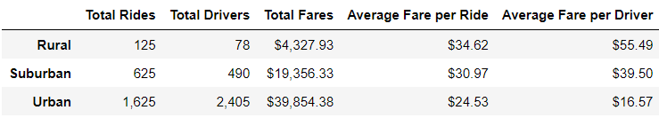

# PyBer_Analysis

#Overview
The client wanted me to create a summary for the PyBer app based on the different city types. In addition, the client wanted a visualization of the weekly fares for each city type over a 4 month period from Jan 2019 to Apr 2019. This is the summary of the findings.

#Results
The summary statistic based on city type is as follows:

