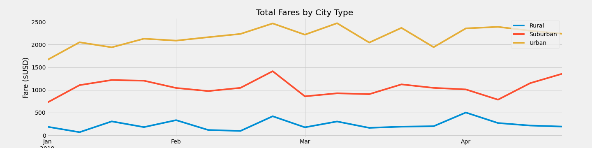

# PyBer_Analysis

## Overview
The client wanted me to create a summary for the PyBer app based on the different city types. In addition, the client wanted a visualization of the weekly fares for each city type over a 4 month period from Jan 2019 to Apr 2019. This is the summary of the findings.

## Results
The summary statistic based on city type is as follows:

As shown in this diagram, we can see that, not surprisingly, Urban Cities have the most rides (1,625 rides) and also has the most drivers (2,405 drivers).
The results show that the average fare increases based on the density of population/drivers in the city types. Rural cities, having the least amount of people/drivers (78 drivers), have the highest average fare ($34.62 per ride). This is not surprising as the lack of drivers means there is a low supply despite a lack of demand. In addition, it is likely that the amount of distance travelled is higher in rural cities as points of interests are probably few and far between.

Urban drivers, in addition, make the least amount on average ($16.57 per driver) as there are more drivers around. They are competing with each other in this market which means there is less money going around per person. All this despite the fact that there is the most money to be earned in Urban cities with a total fare of $39,854.38.

Here is the weekly fares from Jan 2019 to Apr 2019 based on city type:

As shown in the graph, there seems to be common trends of upticks and downticks in fares throughout the 4 months. It is typical for fares to be low in the early parts of January. This is most likely due to the aftermath of holiday season where people are less likely to be travelling because they have already travelled. There is an uptick in fares in the last week of February consistently between all the different types of cities. 

## Summary
Based on the results of the data, here are 3 recommendations:
* test
